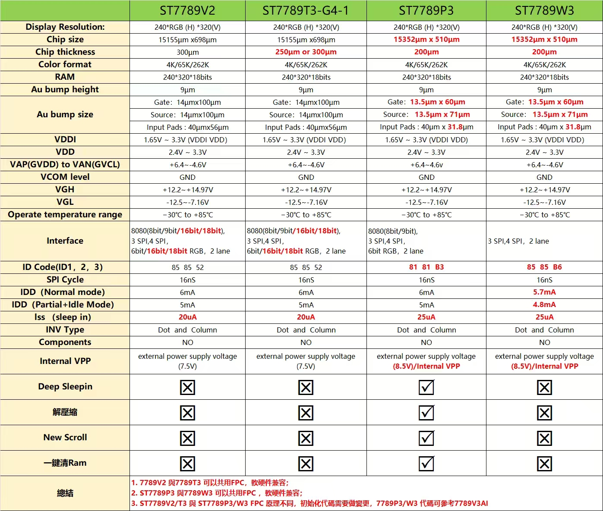

<h1 align="center">OSPTEK 1.69″ TFT 240×280 (ST7789 · SPI)</h1>

<b>TFT module · SPI · ST7789 · Multi-Version Index</b>

English | <a href="./README.md">简体中文</a>

  
  
  
  

## Contents

- [About](#about)
- [ST7789 family variant notes](#st7789-family-variant-notes)
- [Versions](#versions)
- [YDP169HT006-V1](#ydp169ht006-v1)
- [YDP169H001-V3](#ydp169h001-v3)
- [YDP169HB001-P8](#ydp169hb001-p8)
- [Where to Buy](#where-to-buy)
- [Support](#support)

---

## About

This repository holds materials for the **1.69″ 240×280 TFT (SPI · ST7789)** module family. Silicon may be ST7789 / ST7789V3 (also called ST7789P3); the public family name remains **ST7789**.

The **root README is the navigation page**. Use the table below for a quick scan; open **Full docs** to enter that **part-number folder** under `versions/` (product page, datasheets, and examples live there).

Repo id: `1.69-tft-240x280-spi-st7789`

---

## ST7789 family variant notes

- Comparison: [`docs/ST7789-variants-comparison.jpg`](./docs/ST7789-variants-comparison.jpg)
- Companion notes: [`docs/ST7789-variants-notes.jpg`](./docs/ST7789-variants-notes.jpg)

---

## Versions

| Version | Image | Summary | Full docs |
| ------- | ----- | ------- | --------- |
| YDP169HT006-V1 |  | [Summary](#ydp169ht006-v1) | [Full docs](./versions/YDP169HT006-V1/) |
| YDP169H001-V3 |  | [Summary](#ydp169h001-v3) | [Full docs](./versions/YDP169H001-V3/) |
| YDP169HB001-P8 |  | [Summary](#ydp169hb001-p8) | [Full docs](./versions/YDP169HB001-P8/) |

---

## YDP169HT006-V1

**Notes:** With touch (CST816); silicon docs use ST7789P3.

Full product page, datasheets, and examples: [versions/YDP169HT006-V1/](./versions/YDP169HT006-V1/)

---

## YDP169H001-V3

**Notes:** Bare panel; silicon is ST7789V3.

Full product page, datasheets, and examples: [versions/YDP169H001-V3/](./versions/YDP169H001-V3/)

---

## YDP169HB001-P8

**Notes:** Module (no touch); panel part is YDP169H001-V3; silicon is ST7789V3.

Full product page, datasheets, and examples: [versions/YDP169HB001-P8/](./versions/YDP169HB001-P8/)

---

## Where to Buy

  
  &nbsp;&nbsp;
  

**International (AliExpress)**

- Store: [OSPTEK Official Store](https://www.aliexpress.com/store/1105701619)

**China (Taobao)**

- Store: [鱼鹰光电工厂店](https://shop110742373.taobao.com/)

---

## Support

- Technical Support / Sales: <luyu@osptek.com>
- QQ Technical Group: **985881096**
- Website: <https://osptek.com/>
- Feel free to open an Issue in this repository if you have any questions

---

© 2026 OSPTEK · Licensed under CC BY 4.0

