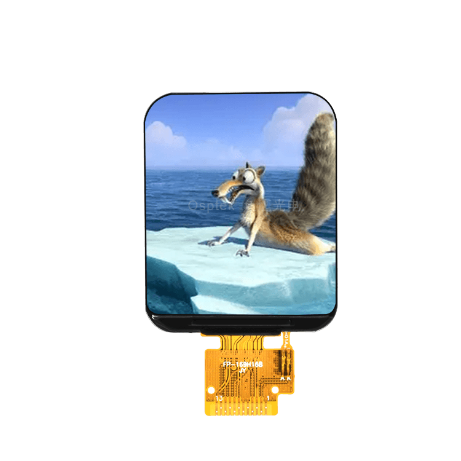

<p align="left"></p>

<h1 align="center">OSPTEK 1.69″ TFT 240×280 (ST7789V3 · SPI)</h1>

<p align="center"><b>TFT panel · SPI · ST7789V3</b></p>

<p align="center"><a href="./README.md">简体中文</a> | English · <a href="../../README_EN.md">Family index</a></p>

<p align="center">
  
  
  
  
</p>

<p align="center"></p>

## Contents

- [Overview](#overview)
- [Specifications](#specifications)
- [Sample projects](#sample-projects)
- [Repository layout](#repository-layout)
- [Resources](#resources)
- [Buy](#buy)
- [Support](#support)

---

## Overview

OSPTEK **1.69″ 240×280 TFT** is a **SPI** color panel driven by **ST7789V3**. This part number covers the **bare panel** specification.

Spec ID (repository name): `tft-1.69-240x280-spi-st7789`

Current panel version: **YDP169H001-V3**. Electrical and mechanical details follow [`docs/YDP169H001-V3.pdf`](./docs/YDP169H001-V3.pdf).

## Specifications

| Item | Spec |
| ---- | ---- |
| Size | 1.69 inch |
| Type | TFT / IPS (color) |
| Resolution | 240×280 |
| Interface | SPI (4-wire) |
| Driver IC | ST7789V3 |

> Full outline, FPC definition, power, and timing follow the product datasheet / driver IC datasheet.

## Sample projects

| Description | Path |
| ---- | ---- |
| ESP32-S3 · ST7789V3 SPI + LVGL9 | [`examples/esp32s3-tft-1.69-240x280-spi-st7789-bringup/`](./examples/esp32s3-tft-1.69-240x280-spi-st7789-bringup/) |

## Repository layout

```text
tft-1.69-240x280-spi-st7789/                                # repo root (nav: ../../README_EN.md)
└── versions/
    └── YDP169H001-V3/                                # full materials for this part number
        ├── README.md
        ├── README_EN.md
        ├── images/
        ├── docs/
        └── examples/
```

## Resources

### Product files

| Resource | Link |
| ---- | ---- |
| Panel datasheet (YDP169H001-V3) | [`docs/YDP169H001-V3.pdf`](./docs/YDP169H001-V3.pdf) |
| Driver IC datasheet (ST7789V3) | [`docs/ST_7789_V3_SPEC_Preliminary_V0_0_200102_8f4b7f4d5d.pdf`](./docs/ST_7789_V3_SPEC_Preliminary_V0_0_200102_8f4b7f4d5d.pdf) |
| Init sequence (INI) | [`docs/HSD1.69IPS-ST7789V2-2.5Gamma-20210824.INI`](./docs/HSD1.69IPS-ST7789V2-2.5Gamma-20210824.INI) |

### Samples

- [ESP32-S3 ST7789V3 SPI + LVGL9](./examples/esp32s3-tft-1.69-240x280-spi-st7789-bringup/)

## Buy

<p align="center">
  <a href="https://www.aliexpress.com/store/1105701619"></a>
  &nbsp;&nbsp;
  <a href="https://shop110742373.taobao.com/"></a>
</p>

**Overseas (AliExpress)**

- Store: [OSPTEK Official Store](https://www.aliexpress.com/store/1105701619)

**China (Taobao)**

- Store: [鱼鹰光电工厂店](https://shop110742373.taobao.com/)

## Support

- Technical support / product inquiry: <luyu@osptek.com>
- QQ group (China): **985881096**
- Website: <https://osptek.com/>
- Feel free to open an Issue in this repository if you have any questions

---

<p align="center"><sub>© 2026 OSPTEK · Materials in this repository are licensed under CC BY 4.0</sub></p>
